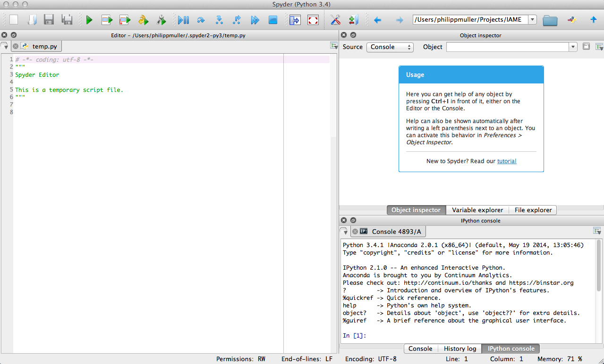

.. _spyder:

Spyder
=========

Download and installation
___________________________

`Spyder <https://code.google.com/p/spyderlib/>`_ is written in Python and therefor only requires a Python distribution (i.e. Anaconda).

To install Spyder, go to their `repository on Bitbucket <https://bitbucket.org/spyder-ide/spyderlib/downloads>`_, download the zip archive named "spyder-2.3.1.zip" (latest as of 24.09.2014) and extract it. Navigate to the new folder inside your terminal and install the application by executing::

    cd /folder-containing-spyder/
    python setup.py install

The setup creates an executable inside the bin folder of your python distribution (i.e. .../anaconda/bin) which should be inside your PATH. You can then launch spyder by simply typing::

    spyder

into your terminal, yielding

